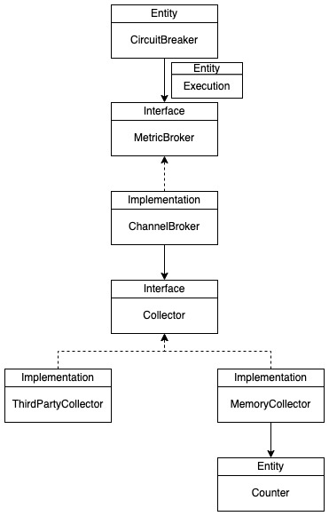

# hystrix

This is a simple version of [hystrix-go](https://github.com/afex/hystrix-go), which is a golang port
of Netflix's [Hystrix project](https://github.com/Netflix/Hystrix). I deliberately choose a simpler
design that is optimized for easier understanding. Although it's covered by equivalent unit tests,
**this project is not intended for production usage**. Please evaluate fully before you use it seriously.

## Design

  

**CircuitBreaker** is the uppermost entity that orchestrates all components to perform the task.
Each time a command is executed, there will be a corresponding **Execution** entity generated along with it.
An **Execution** entity records the status, time span and other aspects of the command.
After the command finishes its execution, the **Execution** entity is reported to a **MetricBroker**.
**MetricBroker** makes the collection process asynchronous so that command execution and metric collection processes are isolated from each other.
The default implementation of **MetricBroker** is **ChannelBroker**.
You can guess directly from its name that it's based on Go's channel.
You can swap **ChannelBroker** with some other ones like **RedisBroker** or **MemcachedBroker** if you like, but I think it's an overkill.
Our **ChannelBroker** contains a **Collector** interface which is responsible for recording the metrics, especially the error percent.
Likewise, we have a default implementation of **Collector**, the **MemoryCollector**,
which simply measures the error percent of each command in memory with the help of **Counter**, a window-based counter.
Each collection service provider can deliver their own implementations of **Collector** and users can choose their implementations to do the collection.
